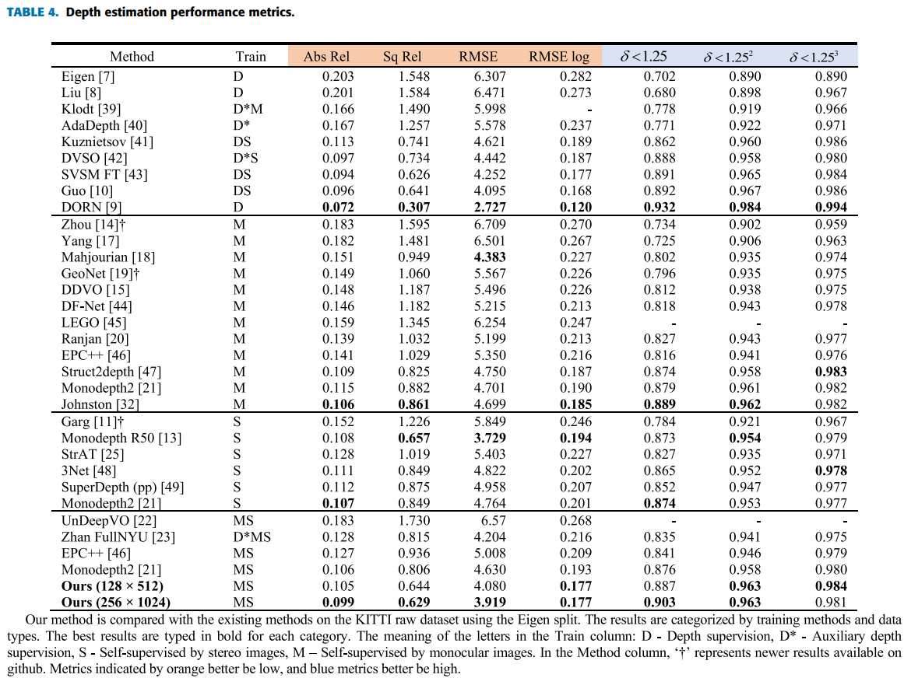

# xpt-mde-2020
This repository manages codes for the works published as ["Self-Supervised Monocular Depth Estimation With Extensive Pretraining"](https://ieeexplore.ieee.org/abstract/document/9622207) by **IEEE Access**

This work aims at monocular depth estimation (MDE) which predicts a depth map from a monocular image. It outperformed the existing studies as follows.




The following manual guides you from dataset preparation to evaluation to reconstruct the best performance we marked.  

This project is implemented in the following environment.

- Ubuntu 20.04
- CUDA 11.1
- Tensorflow 2.4


## 0. Config

All the important parameters are concentrated in "config.py".  

However, there is "config-example.py" but no "config.py" in this repository. "config-example.py" is literally an example for "config.py".

Since "config.py" depends on specific paths in your system and the parameters are edited frequently, it is included in ".gitignore" .

You have to command like  `cp config-example.py config.py` .

The executable scripts in this repository have no options. All the options must be set in "config.py" before execution. I really hate lengthy command like  

```
python geonet_main.py --mode=train_flow --dataset_dir=/path/to/formatted/data/ --checkpoint_dir=/path/to/save/ckpts/ --learning_rate=0.0002 --seq_length=3 --flownet_type=direct --max_steps=400000
```

(Though I respect GeoNet's academic achievements)  

You should revise paths and parameter values for your system. This manual lets you know the meaning of the parameters.  


## 1. Prepare datasets

This work utilizes multiple dataset for pretraining. To accelerate training, raw datasets are converted into the tfrecord format of Tensorflow. It take a considerable amount of time but you can save more time in training if you train the model multiple times with varying options.  

The script you have to execute is "tfrecords/create_tfrecords_main.py" but you have to set parameters in "config.py" before execution.

### Config

```python
RAW_DATA_PATHS = {
    "kitti_raw": "path_to_KITTI_raw_dataset",
    "kitti_odom": "path_to_KITTI_odometry_dataset",
    "cityscapes__sequence": "path_to_cityscapes_sequence_dataset_zip_files",
    "waymo": "path_to_waymo_dataset",
    "a2d2": "path_to_a2d2_dataset_zip_files",
}
RESULT_DATAPATH_LOW = "path_to_resulting_data_path_for_low_resolution_inputs"
RESULT_DATAPATH_HIGH = "path_to_resulting_data_path_for_high_resolution_inputs"


class VodeOptions(LossOptions):
    # lists datasets and their splits to make tfrecords
    # if you don't like to use some dataset, comment the corresponding line
    DATASETS_TO_PREPARE = {"cityscapes__sequence": ["train"],
                           "waymo": ["train"],
                           "a2d2": ["train"],
                           "kitti_raw": ["train", "test"],
                           "kitti_odom": ["train", "test"],
                           }
```


> Note: when you download datasets, you have to get lidar data as well for depth evaluation.


### 1.1. KITTI raw

Download: <http://www.cvlibs.net/datasets/kitti/raw_data.php>  

Download and unzip zip files at `RAW_DATA_PATHS["kitti_raw"]` in config.py .

The directory structure should be like follows.

```
./kitti_raw_data/
├── 2011_09_26
│   ├── 2011_09_26_drive_0001_sync
│   ├── 2011_09_26_drive_0002_sync
    ...
│   ├── 2011_09_26_drive_0119_sync
│   ├── calib_cam_to_cam.txt
│   ├── calib_imu_to_velo.txt
│   └── calib_velo_to_cam.txt
├── 2011_09_28
│   ├── 2011_09_28_drive_0001_sync
│   ├── 2011_09_28_drive_0002_sync
    ...
│   ├── 2011_09_28_drive_0225_sync
│   ├── calib_cam_to_cam.txt
│   ├── calib_imu_to_velo.txt
│   └── calib_velo_to_cam.txt
├── 2011_09_29
│   ├── 2011_09_29_drive_0004_sync
│   ├── 2011_09_29_drive_0026_sync
│   ├── 2011_09_29_drive_0071_sync
│   ├── 2011_09_29_drive_0108_sync
│   ├── calib_cam_to_cam.txt
│   ├── calib_imu_to_velo.txt
│   └── calib_velo_to_cam.txt
├── 2011_09_30
│   ├── 2011_09_30_drive_0016_sync
│   ├── 2011_09_30_drive_0018_sync
│   ├── 2011_09_30_drive_0020_sync
│   ├── 2011_09_30_drive_0027_sync
│   ├── 2011_09_30_drive_0028_sync
│   ├── 2011_09_30_drive_0033_sync
│   ├── 2011_09_30_drive_0034_sync
│   ├── 2011_09_30_drive_0072_sync
│   ├── calib_cam_to_cam.txt
│   ├── calib_imu_to_velo.txt
│   └── calib_velo_to_cam.txt
└── 2011_10_03
 ├── 2011_10_03_drive_0027_sync
 ├── 2011_10_03_drive_0034_sync
 ├── 2011_10_03_drive_0042_sync
 ├── 2011_10_03_drive_0047_sync
 ├── 2011_10_03_drive_0058_sync
 ├── calib_cam_to_cam.txt
 ├── calib_imu_to_velo.txt
 └── calib_velo_to_cam.txt
```


### 1.2. KITTI odom

Download: <http://www.cvlibs.net/datasets/kitti/eval_odometry.php>  

Download and unzip zip files at `RAW_DATA_PATHS["kitti_odom"]` in config.py . You don't have to download gray scale images.  

The directory structure should be like follows.  

```
./kitti_odometry/
├── poses
└── sequences
 ├── 00
 ├── 01
 ...
 └── 21
```


### 1.3. Cityscapes

Download: <https://www.cityscapes-dataset.com/downloads/>

Download only `**_sequence_trainvaltest.zip` files to `RAW_DATA_PATHS["cityscapes__sequence"]` in config.py. **You don't have to unzip them**. `tfrecords/readers/city_reader.py` module reads data directly from zip files.

The file structure should be like follows.  

```
./cityscapes/
├── camera_trainvaltest.zip
├── disparity_sequence_trainvaltest.zip
├── disparity_trainvaltest.zip
├── leftImg8bit_sequence_trainvaltest.zip
├── rightImg8bit_sequence_trainvaltest.zip
└── vehicle_sequence.zip
```


### 1.4. Waymo

Download: <https://waymo.com/intl/en_us/dataset-download-terms/> (version 1.2)  

Download tar files and unzip them into `RAW_DATA_PATHS["wayo"]` in config.py.  

Batch download tool: <https://github.com/RalphMao/Waymo-Dataset-Tool>  

The directory structure should be like follows.  

```
└── waymo
 ├── training_0000
 ├── training_0001
 ...
 ├── training_0027
 ├── validation_0000
 ├── validation_0001
 ...
 └── validation_0007
```


### 1.5. A2D2

Download: <https://www.a2d2.audi/a2d2/en/download.html>

Download tar files into `path_to_A2D2` in config.py.  

Then execute the function `convert_tar_to_vanilla_zip` in `tfrecords/readers/a2d2_reader.py` to convert tar files into zip files in `path_to_A2D2/zips`, which `RAW_DATA_PATHS["a2d2"]` is to be.

It takes long time to read a large tar file but zip files are almost like directories. Extracting tar files yields a great number of files which results in slow file system. We prefer to use zip files which is simple and fast.  

The file structure should be like follows.  

```
./a2d2/
├── Audi Autonomous Driving Dataset.pdf
├── camera_lidar-20180810150607_camera_frontcenter.tar
├── camera_lidar-20180810150607_camera_frontleft.tar
├── camera_lidar-20180810150607_camera_frontright.tar
├── camera_lidar-20180810150607_lidar_frontcenter.tar
├── camera_lidar-20180810150607_lidar_frontleft.tar
├── camera_lidar-20180810150607_lidar_frontright.tar
├── camera_lidar-20190401121727_camera_frontcenter.tar
├── camera_lidar-20190401121727_camera_frontleft.tar
├── camera_lidar-20190401121727_camera_frontright.tar
├── camera_lidar-20190401121727_lidar_frontcenter.tar
├── camera_lidar-20190401121727_lidar_frontleft.tar
├── camera_lidar-20190401121727_lidar_frontright.tar
├── camera_lidar-20190401145936_camera_frontcenter.tar
├── camera_lidar-20190401145936_camera_frontleft.tar
├── camera_lidar-20190401145936_camera_frontright.tar
├── camera_lidar-20190401145936_lidar_frontcenter.tar
├── camera_lidar-20190401145936_lidar_frontleft.tar
├── camera_lidar-20190401145936_lidar_frontright.tar
├── camera_lidars.json
└── zips
 ├── camera_lidar-20180810150607_camera_frontleft.zip
 ├── camera_lidar-20180810150607_camera_frontright.zip
 ├── camera_lidar-20180810150607_lidar_frontleft.zip
 ├── camera_lidar-20180810150607_lidar_frontright.zip
 ├── camera_lidar-20190401121727_camera_frontleft.zip
 ├── camera_lidar-20190401121727_camera_frontright.zip
 ├── camera_lidar-20190401121727_lidar_frontleft.zip
 ├── camera_lidar-20190401121727_lidar_frontright.zip
 ├── camera_lidar-20190401145936_camera_frontleft.zip
 ├── camera_lidar-20190401145936_camera_frontright.zip
 ├── camera_lidar-20190401145936_lidar_frontleft.zip
 ├── camera_lidar-20190401145936_lidar_frontright.zip
 └── cams_lidars.json
```


### 1.6. Convert to tfrecord

```
cd path_to_project
# activate virutal environment
python tfrecords/create_tfrecords_main.py
```


## 2. Train

The training process is supervised by `TRAINING_PLAN`. A row of the training plan includes:

1. network architecture
2. dataset
3. a number of epochs to train
4. learning rate
5. loss combination
6. scale weights
7. whether to save checkpoint

The details of components can be found in the rest of "config.py" or the published paper.

```python
class FixedOptions:
    STEREO = True		# whether to use stereo images
    HIGH_RES = False	# whether to use high resolution input


class VodeOptions(LossOptions):
    CKPT_NAME = "mde01"		# check point directory name in DATAPATH_CKP
    DEVICE = "/GPU:0"		# the device to be used


class LossOptions(FixedOptions):
    LOSS_PRETRAIN_STEP3 = [LOSS_RIGID_T2, LOSS_RIGID_MOA_WST][0]
    LOSS_FINETUNE_STEP3 = [LOSS_RIGID_T2, LOSS_RIGID_MOA_WST, LOSS_RIGID_COMB][2]
    FINE_TUNE_NET = [FixedOptions.RIGID_NET, FixedOptions.JOINT_NET][1]
    TRAINING_PLAN_28 = [
        # pretraining
        (FixedOptions.RIGID_NET, "kitti_raw", 5, 0.00001, LOSS_RIGID_T1, F.SCALE_WEIGHT_T1, True),
        (FixedOptions.RIGID_NET, "kitti_raw", 10, 0.0001, LOSS_PRETRAIN_STEP3, F.SCALE_WEIGHT_T1, True),
        (FixedOptions.RIGID_NET, "a2d2", 10, 0.0001, LOSS_PRETRAIN_STEP3, F.SCALE_WEIGHT_T1, True),
        (FixedOptions.RIGID_NET, "waymo", 10, 0.0001, LOSS_RIGID_T2, F.SCALE_WEIGHT_T1, True),
        (FixedOptions.RIGID_NET, "kitti_odom", 10, 0.0001, LOSS_PRETRAIN_STEP3, F.SCALE_WEIGHT_T1, True),
        (FixedOptions.RIGID_NET, "cityscapes", 10, 0.00001, LOSS_PRETRAIN_STEP3, F.SCALE_WEIGHT_T1, True),
        (FixedOptions.RIGID_NET, "kitti_raw", 5, 0.0001, LOSS_PRETRAIN_STEP3, F.SCALE_WEIGHT_T1, True),
        # fine tuning
        (FINE_TUNE_NET, "kitti_raw", 10, 0.0001, LOSS_FINETUNE_STEP3, F.SCALE_WEIGHT_T1, True),
        (FINE_TUNE_NET, "kitti_raw", 10, 0.00001, LOSS_FINETUNE_STEP3, F.SCALE_WEIGHT_T1, True),
        (FINE_TUNE_NET, "kitti_raw", 5, 0.000001, LOSS_FINETUNE_STEP3, F.SCALE_WEIGHT_T1, True),
    ]

class VodeOptions(LossOptions):
    TRAINING_PLAN = L.TRAINING_PLAN_28
```

  

To train model, save log data and check points, run `train_by_plan` in "model/model_main.py". The resulting data will be saved in `DATAPATH_CKP/CKPT_NAME` in "config.py" 

```
cd path_to_project
# activate virutal environment
python model/model_main.py
```


## 3. Predict

With saved checkpoints, you can save predicted outputs from test dataset. By adding rows in `TEST_PLAN`, multiple results can be saved from multiple checkpoints. A row of the test plan includes:

1. Network architecture
2. Dataset that has a test split.
3. Output type
4. Checkpoint name (`CKPT_NAME`)
5. Specific checkpoint name or just "latest" for the latest checkpoint

```python
class VodeOptions(LossOptions):
    RIGID_EF5 = {"depth": "EfficientNetB5", "camera": "PoseNetImproved", "flow": "PWCNet"}

    TEST_PLAN_LOW = [
        (RIGID_EF5, "kitti_raw", ["depth"], "mde01", "latest"),
    ]

    TEST_PLAN_HIGH = [
        (RIGID_EF5, "kitti_raw", ["depth"], "mde01", "latest"),
    ]
    
    TEST_PLAN = TEST_PLAN_HIGH if FixedOptions.HIGH_RES else TEST_PLAN_LOW
```

To predict depth maps, run `predict_by_plan` in "model/model_main.py". The last lines should be changed like

```python
if __name__ == "__main__":
    predict_by_plan()
```

Then execute

```
cd path_to_project
# activate virutal environment
python model/model_main.py
```

The result will be saved at `DATAPATH_PRD` in "config.py"


## 4. Evaluate

To evaluate the prediction results, you just command like

```
cd path_to_project
# activate virutal environment
python evaluate/evaluate_main.py
```

The result will be saved at `DATAPATH_EVL` in "config.py"


## 5. Variations

You can change model architecture, loss combinations, training datasets, and learning rate in `TRAINING_PLAN`.  

There are various loss combinations from `LOSS_RIGID_T1` to `LOSS_RIGID_MD2` in "config.py" , or you can make a new loss combination. 

There are 13 options for backbone architecture for DepthNet.  

```python
    JOINT_NET = {"depth": ["DepthNetBasic", "DepthNetNoResize", "MobileNetV2", "NASNetMobile",
                           "DenseNet121", "VGG16", "Xception", "ResNet50V2", "NASNetLarge",     # 4~
                           "EfficientNetB0", "EfficientNetB3", "EfficientNetB5", "EfficientNetB7"][11],  # 9~
                 "camera": "PoseNetImproved",
                 "flow": "PWCNet"
                 }
```

The model architectures and loss functions are assembled in factories like `ModelFactory` or `loss_factory` as defined in "config.py"

